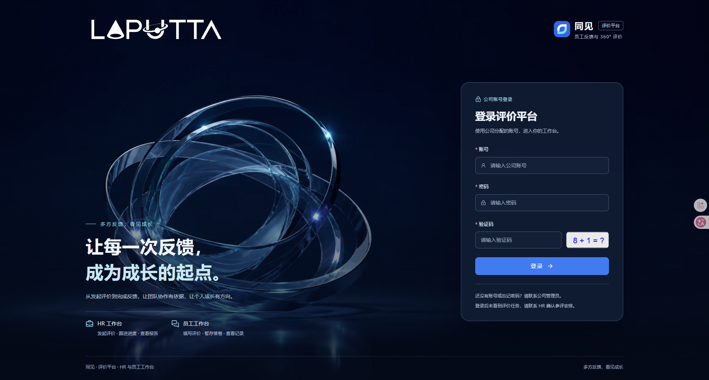
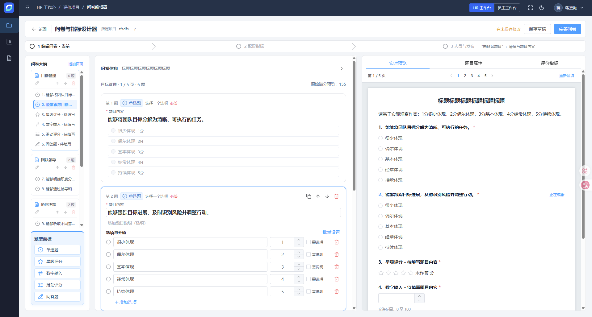
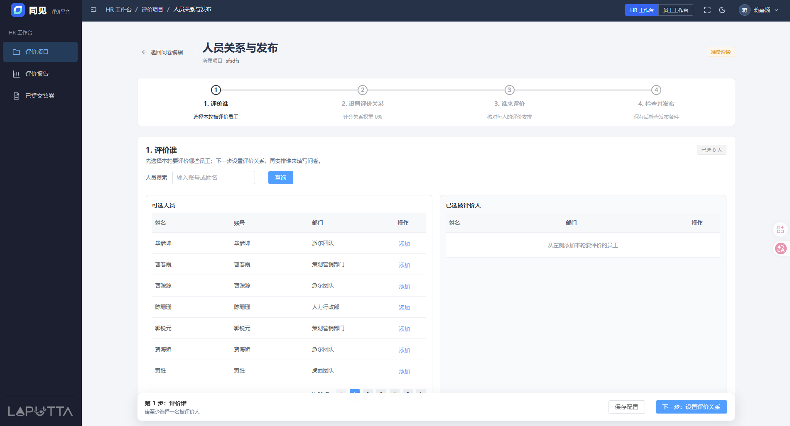
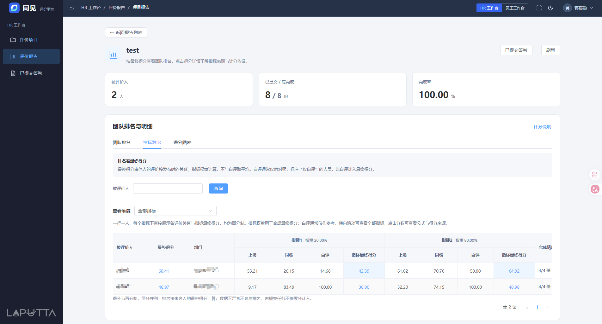

# 同见 · 员工反馈与 360° 评价平台

多方反馈，看见成长。

同见用于公司内部的员工反馈与多关系评价。HR 配置问卷、参评人员及评价关系，发布后由员工登录填写，HR 跟进回收、手动完成项目并查看报告。系统管理端统一维护账号、组织和权限。

- [评价平台（HR / 员工）](http://192.168.10.122:12681/)
- [管理中心（账号 / 组织 / 权限）](http://192.168.10.122:12680/)
- [项目设计与验收文档](./docs/feedback/README.md)

## 功能与业务约定

| 使用方 | 主要能力 |
| --- | --- |
| HR 工作台 | 创建评价项目、使用系统问卷模板、编辑题目与指标、配置参评关系、发布、跟进回收、手动完成及查看报告 |
| 员工工作台 | 我的待办、按被评价人逐人暂存和提交、查看本人已提交评价 |
| 管理中心 | 用户、部门、岗位、角色、菜单、权限配置，以及日志和运行监控 |

项目按“准备阶段 → 进行阶段 → 已完成”流转。发布时冻结问卷与计分配置；已提交答卷不可修改，原始答案保留。项目由 HR 手动完成，完成后未提交任务关闭。正式得分由后端计算，报告使用已提交答卷并展示完成率和缺失情况。

当前通过已登录账号参评，不提供公开匿名链接、二维码、小程序或自动结束项目。系统问卷模板随代码发布，具体规则见[系统问卷模板](./docs/feedback/20-system-questionnaire-templates.md)。

## 系统界面预览

以下截图按“登录 → 问卷设计 → 人员配置与发布 → 报告查看”的顺序展示主要界面。

### 公司账号登录

使用公司账号登录评价平台，按账号权限进入 HR 或员工工作台。



### 问卷与指标设计

在同一页面维护问卷结构、编辑题目及选项分值，并实时预览填写效果。



### 参评人员配置与发布

按步骤选择被评价人、设置评价关系、分配评价人，检查配置后发布项目。下图展示人员选择界面。



### 项目报告

查看答卷回收与完成率，并通过团队排名、指标对比及各关系得分了解评价结果。



## 工程结构与技术栈

| 目录 | 职责 | 技术栈 |
| --- | --- | --- |
| `feedback-frontend/` | 评价业务平台，包含 HR / 员工工作台 | Vue 3、Vite、Element Plus、Pinia、Vue Router、Axios |
| `ruoyi-fastapi-frontend/` | 系统管理端，不承载评价业务页面 | 复用 RuoYi 管理端基础能力 |
| `ruoyi-fastapi-backend/` | 唯一业务后端，评价核心模块为 `module_feedback` | FastAPI、SQLAlchemy 异步会话、Pydantic、Alembic、Redis、JWT/OAuth2 |
| `deploy/` | 打包、远程发布、保护检查和部署测试 | PowerShell、Python、Bash、SSH/SCP |
| `docs/feedback/` | 产品、架构、迁移、验收与运维文档 | 中文项目文档 |

数据库固定使用 **PostgreSQL**。评价业务复用现有系统用户、部门、角色和权限，不建立第二套身份体系。`ruoyi-fastapi-*` 目录名保留上游工程命名，产品名称统一为“同见”。仓库保留的其他上游工程和示例不属于当前部署入口。

## 公司内网部署与日常更新

### 实际运行的 Compose 配置

**服务器同时使用以下两个文件，顺序固定，不能只执行其中一个：**

| 文件 / 参数 | 职责 |
| --- | --- |
| [`docker-compose.pg.yml`](./docker-compose.pg.yml) | 主配置：管理前端、评价前端、唯一后端、PostgreSQL、Redis、迁移任务，以及持久化卷和网络 |
| [`docker-compose.intranet.yml`](./docker-compose.intranet.yml) | 内网覆盖配置：对后端与迁移任务关闭应用层传输加密，支持本项目约定的 HTTP 访问 |
| `-p tongjian-prod` | 固定 Compose 项目名，决定容器、网络和数据卷的归属 |
| `--env-file .env.deploy` | 读取当前发布版本的端口、访问地址、镜像标签和密钥目录等部署参数 |

SSH 登录服务器后，完整查看命令为：

```bash
cd /opt/tongjian/current
docker compose -p tongjian-prod --env-file .env.deploy \
  -f docker-compose.pg.yml \
  -f docker-compose.intranet.yml ps -a
```

快速部署脚本已封装上述组合。手动维护同样必须带齐项目名、环境文件和两个 `-f` 参数；仅执行主配置会丢失内网 HTTP 的加密策略覆盖，不指定项目名则可能操作另一个 Compose 项目。

### 服务器、网址与端口

目标服务器：`root@192.168.10.122`，主机名 `lbt-Precision-T1700`，Ubuntu 24.04.4 LTS，8 逻辑 CPU / 32 GB 内存；Docker Engine 29.5.2、Compose v5.1.4（2026-09-07 实测）。

| 服务 | 访问入口 / 端口 | 运行方式 |
| --- | --- | --- |
| 同见评价平台（HR / 员工） | http://192.168.10.122:12681/ | `tongjian-prod-feedback-frontend-1`，容器 Nginx 80 |
| 同见系统管理端 | http://192.168.10.122:12680/ | `tongjian-prod-ruoyi-frontend-1`，容器 Nginx 80 |
| 同见业务后端 | 容器内部 9099，不映射宿主端口 | `tongjian-prod-ruoyi-backend-pg-1` |
| 同见 PostgreSQL 17 | 容器内部 5432，不映射宿主端口 | `tongjian-prod-ruoyi-pg-1`，数据库 `ruoyi_feedback_prod` |
| 同见 Redis 7.4 | 容器内部 6379，不映射宿主端口 | `tongjian-prod-ruoyi-redis-1`，应用使用逻辑库 2 |
| 数据库迁移 | 无端口，一次性容器，完成后删除 | `feedback-migrate`，每次发布执行 Alembic + 结构核验 |

浏览器 → 内网 IP 的 12680/12681 → 对应容器 Nginx → `/prod-api/` 去除前缀 → 同一个后端 9099 → 独立 PostgreSQL / Redis。两端都支持 history 路由刷新；管理端跳转评价平台的 URL 在构建时注入。用户于 2026-09-07 明确选择公司内网 HTTP。`docker-compose.intranet.yml` 对后端和迁移任务设置 `TRANSPORT_CRYPTO_ENABLED=false`、`TRANSPORT_CRYPTO_MODE=off`，两个前端从服务器读取该策略，无需修改业务代码。原因是 Web Crypto 在普通内网 HTTP 上不可用（[浏览器约束](https://developer.mozilla.org/en-US/docs/Web/API/SubtleCrypto)）。登录鉴权和角色权限仍启用，但密码、Token、评价内容没有传输加密保护，不应把当前端口暴露到公网。以后接入 HTTPS 时，先部署可信证书和代理、修改公开 URL，再移除内网覆盖配置中的这两个关闭项，并重建前端、验证加密登录。

**与已有项目隔离：** 不使用已经属于 Shot Grid 的 `12580/12581/12582`；不复用其数据库、Redis、密钥、网络和卷。宿主机现有 Nginx 是宝塔管理的实例，主配置 `/www/server/nginx/conf/nginx.conf`，监听 80/888；同见使用自己的容器 Nginx，不修改或重启宿主 Nginx。也不重启 Docker 或操作系统。

2026-09-07 部署前基线：Shot Grid 五个容器健康，管理端与业务端返回 HTTP 200；Agent Factory 使用 39081/39082；Gatekeeper 使用 3000/8000/5555/5432/6379。Canvas 的 `demiurge-ai-canvas-web-gateway-1` 在本次部署前已反复重启，应作为独立既有问题处理。服务器存在待更新/重启提示，本项目发布不执行系统升级或重启。

### 以后迭代完成后的快速部署命令

在本地仓库根目录 PowerShell 执行：

```powershell
.\deploy\remote-deploy.ps1
```

前提：SSH 免密可连接 `root@192.168.10.122`；本地有 Python 3（优先自动使用后端 `.venv`）、Git、OpenSSH；**先完成验证并提交本次代码**。默认只打包当前 `HEAD`，不会部署未提交改动，不要求先推送 Git 远端；`.env.dev`、密钥、依赖目录、日志与输出不会进入发布包。不要把“本地修改了”当作“服务器已经更新”。

首次交付部署脚本尚未提交时，可显式发布工作区快照：

```powershell
.\deploy\remote-deploy.ps1 -WorkingTree
# 只生成并检查源码包，不连接服务器：
.\deploy\remote-deploy.ps1 -PackageOnly
```

工作区快照包含 Git 可见的未提交文件并排除敏感/本地配置，版本号包含 HEAD、UTC 时间和内容摘要；`release-manifest.json` 明确记录是否工作区快照。普通迭代优先使用默认的已提交版本发布。

自动流程：打包 → 上传新版本目录 → 配置/端口检查 → 保存其他容器基线 → **串行构建三个镜像** → 构建成功后停止同见写入 → 备份数据库/文件/密钥 → 每次重新执行迁移 → 后端健康 → 两端启动 → HTTP/API 校验 → 核对其他运行容器未重启/替换 → 切换 `current`。构建失败不会停止现有同见服务；升级维护窗口从停止同见开始，其他项目不参与。

包源：该服务器 Docker Hub 直连超时，使用 `docker.m.daocloud.io/library/` 镜像前缀，APT/Python 使用清华源，npm 使用镜像源。均为部署参数，不修改 Docker daemon 全局配置；依赖层有缓存，业务代码修改可复用。运行容器设置 CPU/内存上限；发布按项目加锁，拒绝并发部署。

### 服务器目录、配置与持久化

| 位置 | 用途 |
| --- | --- |
| `/opt/tongjian/current` | 指向最后一次通过发布检查的版本目录 |
| `/opt/tongjian/releases/<版本号>/` | 每次独立源码、Compose、`.env.deploy`、版本清单 |
| `/opt/tongjian/shared/.env.deploy` | 下一次发布读取的持久部署参数，不存密码 |
| `/opt/tongjian/shared/secrets/` | 数据库、Redis、JWT、传输 RSA 密钥；目录 700 / 文件 600 |
| `/opt/tongjian/shared/initial-admin-password` | 首次随机管理员密码，root 可读；管理员用户名 `admin` |
| `/opt/tongjian/logs/<版本号>.log` | 每次发布日志；同目录 `*-before.json` 为其他容器基线 |
| `/opt/tongjian/backups/<版本号>/` | 升级前 `database.dump`、`files.tar.gz`、密钥及上一版本路径 |
| `/opt/tongjian/incoming/` | 上传的无密钥源码包 |

固定 Compose 项目名 **`tongjian-prod`**。数据卷为 `tongjian-prod_postgres_data`、`tongjian-prod_redis_data`、`tongjian-prod_backend_files`、`tongjian-prod_backend_logs`；网络为 `tongjian-prod_ruoyi-network`。不随版本目录变化而更名，**不要执行 `down -v`、全局 prune 或覆盖旧项目目录**。

首次为独立空库：官方 PostgreSQL 入口仅在新数据卷导入系统基线，再执行评价 Alembic 迁移。不会把本地开发账号、员工、评价项目和答卷同步到服务器。脚本在开放入口前随机化管理员密码、停用演示账号；普通升级不重置管理员密码。管理员通过 SSH 在自己终端读取初始密码并登录后修改，不要贴到聊天或提交 Git：

```powershell
ssh root@192.168.10.122 'cat /opt/tongjian/shared/initial-admin-password'
```

后续在管理端创建正式用户、部门与角色，为 HR / 员工配置评价权限。修改管理员密码后，初始密码文件不再表示当前密码，按公司密码管理方式保管新密码。

### 状态、日志和故障恢复

SSH 登录后执行：

```bash
cd /opt/tongjian/current
docker compose -p tongjian-prod --env-file .env.deploy -f docker-compose.pg.yml -f docker-compose.intranet.yml ps -a
docker compose -p tongjian-prod --env-file .env.deploy -f docker-compose.pg.yml -f docker-compose.intranet.yml logs --tail 100 ruoyi-backend-pg
cat release-manifest.json
```

发布失败先看 `/opt/tongjian/logs/<版本号>.log`。`current` 仅在校验通过后改变；**它不保证失败时运行容器仍是旧镜像**，因为数据库迁移和应用启动可能已发生。备份是受限文件，不上传仓库；本次首次空库备份已恢复到独立临时数据库验证通过。以后有真实员工和答卷后，仍需定期执行独立库恢复演练；仅校验 dump 目录可读不等于恢复成功。另行把备份复制到受控的其他机器，避免服务器磁盘故障同时丢失原数据和备份。

- 构建/上传失败：旧服务仍运行，修复包源或构建错误后重新执行快速命令。
- 备份/迁移/启动失败：同见可能仍在维护状态；先查日志与迁移版本，禁止盲目重放初始化 SQL、删除卷或自动 Alembic 降级。
- 需要回退应用：从对应备份的 `previous-release` 找到完整旧版本路径，先确认旧代码兼容当前数据库结构，再进入旧目录执行以下命令。不能确认兼容时，先在独立库恢复备份验证，避免覆盖正式已提交答卷。

```bash
# 先 cd 到经确认兼容的旧版本目录，而不是猜测版本号。
docker compose -p tongjian-prod --env-file .env.deploy -f docker-compose.pg.yml -f docker-compose.intranet.yml up -d --no-deps --wait --wait-timeout 180 ruoyi-backend-pg
docker compose -p tongjian-prod --env-file .env.deploy -f docker-compose.pg.yml -f docker-compose.intranet.yml up -d --no-deps ruoyi-frontend feedback-frontend
python3 deploy/server_guard.py health 192.168.10.122 12680 12681
# 检查通过后，才把 current 指向当前已验证的旧目录。
ln -sfn "$PWD" /opt/tongjian/current
```

通用部署说明见 [PostgreSQL Docker 部署](./docs/feedback/22-production-docker-deployment.md)，实施与验收记录见 [内网部署计划](./docs/feedback/23-intranet-deployment-plan.md)。2026-09-07 已部署并通过两个前端的真实登录、刷新、鉴权与空库备份恢复验证；原有正常服务未被重启或替换。首次发布采用显式工作区快照；后续迭代应先提交代码再使用默认快速部署命令。最新版本号以服务器 `current/release-manifest.json` 为准。

## 本地开发

日常开发需要打开 **三个独立的 PowerShell 终端**，分别运行后端、管理端和评价平台，启动后保持终端打开。下面使用本机项目的绝对路径，可以直接复制命令；项目移动后替换对应路径。停止服务时在对应终端按 `Ctrl+C`。

推荐与生产构建一致的 Python 3.11、Node.js 22；开发数据库使用 PostgreSQL，Redis 使用兼容版本，建议与部署的 Redis 7.4 对齐。不要把开发配置指向正式库。

### 后端

首次安装使用项目自己的虚拟环境，已有 `.venv` 时不要重复创建。创建前确认 `python` 来自独立 Python 安装，不要复用其他应用的虚拟环境。

```powershell
cd D:\work\renshi-employees-feedback\ruoyi-fastapi-backend
python --version
python -m venv .venv
.\.venv\Scripts\python.exe -m pip install -r requirements-pg.txt
```

在后端 `.env.dev` 配置开发数据库、Redis 和应用参数。新库先初始化 PostgreSQL 系统基线，再执行 Alembic；已有库不得重放含删表语句的初始化 SQL。具体新库、旧库接管和结构核验步骤见[启动与迁移手册](./docs/feedback/17-operations-runbook.md#3-数据库升级与接管)。

配置和迁移就绪后，**终端一：启动后端**。已有虚拟环境和依赖时，日常只需执行：

```powershell
cd D:\work\renshi-employees-feedback\ruoyi-fastapi-backend
.\.venv\Scripts\Activate.ps1
ruoyi app run --env=dev
```

后端本地端口为 `9099`。配置需要排查时参阅 [CLI 使用说明](./ruoyi-fastapi-backend/docs/cli_usage.md)。`.env.prod` 是生产模板；服务器实际数据源和密钥由容器入口根据 Compose 参数及文件密钥注入，不使用本地 `.env.dev`。

需要检查开发配置时，可在激活虚拟环境后执行 `ruoyi app doctor --env=dev`。

### 管理端（终端二）

```powershell
cd D:\work\renshi-employees-feedback\ruoyi-fastapi-frontend
npm run dev
```

当前 Vite 配置默认使用 **80** 端口，访问 [管理端首页](http://localhost/index)。如需改用 5173，可执行 `npm run dev -- --port 5173 --strictPort`，然后访问 `http://localhost:5173/`。实际启动地址以终端输出为准。

开发时在该工程的开发环境配置中将 `VITE_FEEDBACK_APP_URL` 指向 `http://localhost:5174/`；服务器地址由部署脚本在构建时注入。账号和密码以各自数据库实际配置为准，不使用外部演示系统凭据。

### 评价平台（终端三）

```powershell
cd D:\work\renshi-employees-feedback\feedback-frontend
npm run dev
```

默认访问 [评价平台](http://localhost:5174/)，开发 API 通过 `/dev-api` 代理到本地后端。使用 `localhost` 进行开发，不能把开发服务器直接当作内网生产入口。

两个前端首次安装或锁文件更新后，先在各自目录执行 `npm ci`，再执行 `npm run dev`；日常启动无需重复安装依赖。

### 修改与验证

编码前阅读 [AGENTS.md](./AGENTS.md) 和相关产品、架构文档。数据库结构通过 Alembic 交付；产品状态、评分或范围变化同步更新业务文档。

常用定向验证命令：

```powershell
# 仓库根目录：发布包、HTTP策略和其他项目保护检查
.\ruoyi-fastapi-backend\.venv\Scripts\python.exe -m pytest deploy/tests -q

# 评价前端目录：单元测试和构建
cd .\feedback-frontend
npm test
npm run build
```

后端和真实业务 E2E 按修改范围选择测试，并使用隔离数据库；不要直接向正式库写入测试项目。历史通过记录不替代本次代码验证，具体验收边界见下方文档。

## 文档导航与验收边界

| 文档 | 查阅内容 |
| --- | --- |
| [项目文档索引](./docs/feedback/README.md) | 产品基线、工程边界、数据模型和分阶段实施 |
| [本地启动与数据库运维](./docs/feedback/17-operations-runbook.md) | 开发启动、迁移、权限和旧库接管 |
| [通用 PostgreSQL Docker 部署](./docs/feedback/22-production-docker-deployment.md) | 容器入口、文件密钥、迁移与通用部署原理 |
| [内网服务器部署验收](./docs/feedback/23-intranet-deployment-plan.md) | 2026-09-07 实际发布版本、环境检查、登录和备份恢复证据 |
| [品牌与名称约定](./docs/feedback/19-brand-identity.md) | 同见名称、标识及两个平台的命名 |

本 README 的服务器版本、端口和运行结论来自 2026-09-07 部署验收。后续调整服务器地址、端口、Compose、代理或发布流程时，应同步更新本文件；每次实际发布版本以服务器 `release-manifest.json` 和发布日志为准。已部署及登录检查通过不等于覆盖所有真实业务场景，正式用户、组织与权限仍需由公司管理员配置。

## 来源与许可证

本项目基于 RuoYi-Vue3-FastAPI 二次开发，保留并复用其系统管理与后端公共能力。感谢上游作者及贡献者；原有版权与许可声明见 [LICENSE](./LICENSE)。
